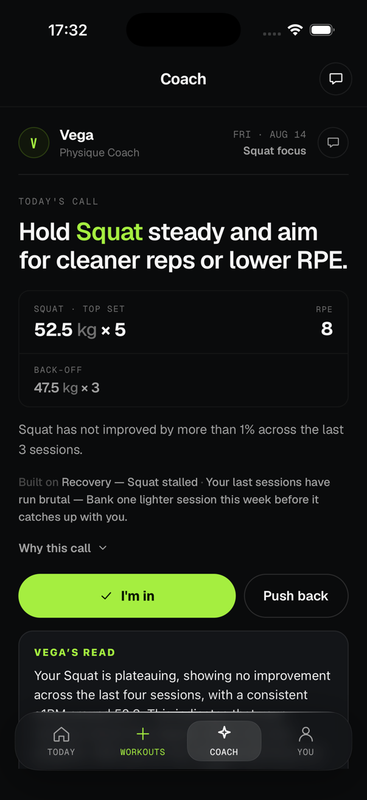
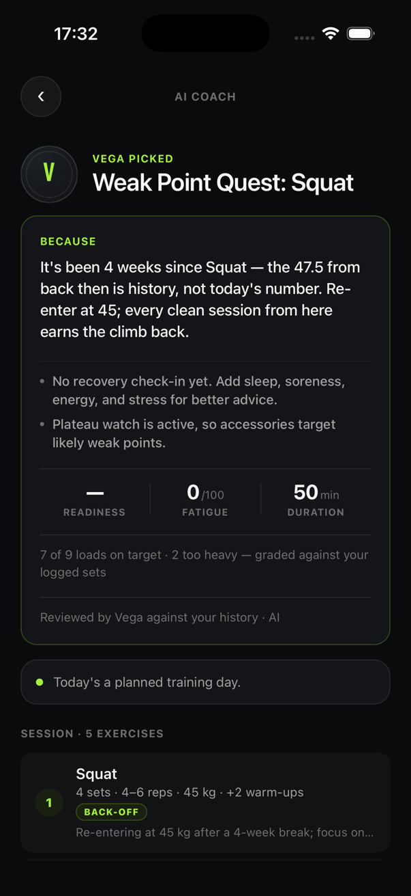
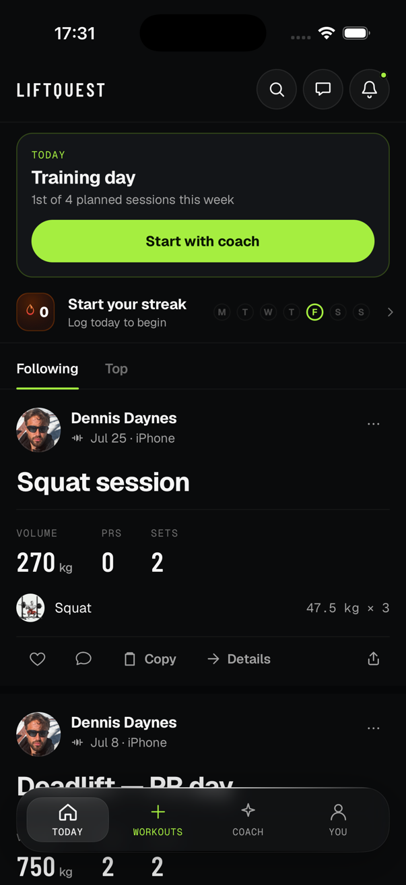
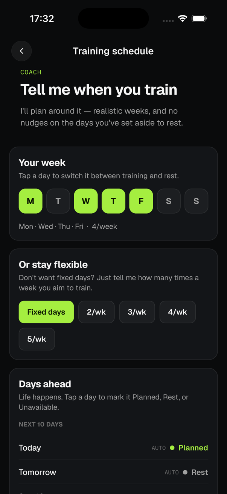
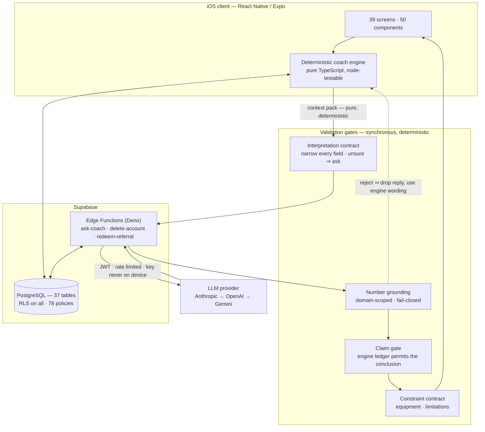

# LiftQuest

An iOS strength-training app where an LLM coach talks to the athlete, and a deterministic engine owns every number it is allowed to say.

Built solo over three months as a single-author production codebase: 94k lines of TypeScript, a 37-table Postgres schema with row-level security on every table, and a validation layer that drops model output which cannot be traced back to computed evidence.

It is a complete application rather than a demo of one idea — 39 screens covering workout logging, AI session generation, coach chat, programs, recovery and body measures, nutrition, a social feed with friends and direct messages, leaderboards, referrals and a subscription paywall — running against live Supabase infrastructure with all 42 migrations applied in production. The documents below concentrate on the parts that were hard rather than the parts that were many.

**Status:** pilot release candidate. The iOS production bundle exports clean and all release gates pass; Apple Developer enrollment and the EAS project link are the remaining steps before an internal TestFlight build. Nothing has shipped to testers yet — see [Release status](#release-status).

`React Native` · `Expo SDK 54` · `TypeScript (strict)` · `Supabase` · `PostgreSQL` · `Deno Edge Functions` · `Claude / GPT / Gemini`

> **This repository is a technical case study, not the source.** The production codebase is private and stays private. Everything here describes the engineering — architecture, validation contracts, test evidence, decisions and the bugs behind them — without publishing the product. Happy to walk through the implementation directly in an interview.

---

## The problem

Strength training software is split between two failures. Logging apps record what you did and tell you nothing. AI fitness apps generate plausible-sounding programmes from a chat prompt, with no memory of your actual training and no way to tell a real observation from an invented one.

The second failure is the interesting one. An LLM asked "how is my bench going?" will happily answer *"your bench e1RM is 102.5 kg, up 8% since May"* whether or not any of those numbers exist. In a coaching product that error is not cosmetic — it gets written to memory, read back as history, and used to prescribe load.

LiftQuest is built around the position that a language model should never be the source of a fact about your training.

## The split

> **The engine owns the diagnosis. The model owns the phrasing.**

Every number, verdict, and prescription is computed by pure TypeScript modules from logged training data. The model's job is to interpret what the athlete asked and to say the engine's answer like a coach would. Between the two sits a set of deterministic gates that reject anything the model added on its own.

When a gate rejects a reply, the reply is **dropped, never edited** — the app falls back to the engine's own wording, or to silence. The user sees a slightly blunter coach; they never see an invented number.

---

## Screenshots

<table>
<tr>
<td width="25%"></td>
<td width="25%"></td>
<td width="25%"></td>
<td width="25%"></td>
</tr>
<tr>
<td valign="top"><b>Today's call.</b> The prescription, the receipt it came from — <i>"Squat has not improved by more than 1% across the last 3 sessions"</i> — and the coach's prose read underneath. The number is the engine's; the sentence is the model's.</td>
<td valign="top"><b>Generated session.</b> Why this session, graded against logged sets, and an <b>unknown readiness rendered as unknown</b> — not as a plausible score. Model contribution is labelled where it appears.</td>
<td valign="top"><b>Today.</b> The day's decision first, then training history. Weeks, not consecutive days, drive the consistency strip.</td>
<td valign="top"><b>Schedule.</b> Rest days are a plan, not a gap — the product never pays for training on a day you set aside to recover.</td>
</tr>
</table>

Captured from a development build on the iOS Simulator, signed into the author's own account. No other users' data appears.

---

## What is technically interesting

### 1. A grounding gate that is deterministic, not another model

Model replies pass through synchronous, pure-TypeScript validation before rendering. No judge LLM, no second call, no added latency.

**Number grounding** — every quantity in a reply must appear in the engine-authored evidence the model was given, *and* must match its domain. An RPE of 8 does not license "up 8%". An estimated 1RM does not license a working load. A bodyweight does not license a weight on the bar.

Two rules make it a gate rather than a digit search:

- **Fail-closed on sections.** Only blocks with a known engine-authored heading count as evidence. The athlete's own notes and stored memory are deliberately excluded — a note reading *"my bench is basically 500 kg on a good day"* must never license the coach to repeat it as fact. User text is the question, never the proof.
- **Dates are not quantities.** Date digits are stripped before extraction, so "Jul 10" never grounds "10 sets".

**Claim grounding** — the harder half. Claims like *"you've plateaued"*, *"fatigue is accumulating"*, *"that adjustment worked"* carry no digits and pass any number check. A typed claims ledger is built deterministically from what the engine actually computed — plateau flags, per-lift trends, the deload verdict, whether the recovery signal is measured or merely assumed — and a claim is permitted only where the ledger grants it, scoped per exercise. Negation, question, and conditional guards let honest denials through: *"no plateau signal is active"* is not a plateau claim.

### 2. Interpretation as a routing decision, never a claim

Understanding what the athlete asked was originally a keyword table. It failed the way keyword tables fail: *"give a bicep workout"* matched nothing, fell back to the athlete's goal lift, and returned a **squat session** explained in confident detail. Every number in that answer was true. It answered a different question.

Classification moved to the model — but under a contract. The model returns structured JSON that is narrowed field by field; an unrecognised shape rejects the *whole* interpretation rather than acting on half a reading; and the load-bearing rule: **a reading that is unsure of itself routes to a question, not an answer.** A coach that guesses in silence is worse than one that asks.

### 3. Bounded authority over generated programmes

The deterministic engine drafts each session from movement-pattern slot templates, per-lift progression state, RPE calibration, accumulated workload, and plateau signals. The model then reviews the draft and may do exactly three things: choose among alternatives the engine already listed, write a per-exercise note, and headline the session.

It has no authority over loads, sets, or reps. Swap targets are validated against the draft's own alternatives list. Anything failing validation degrades to the engine's own receipt.

### 4. Provenance on everything the app believes

A value with no source is indistinguishable from a fact. Onboarding once wrote a "sane default" bodyweight of 78 kg — and from that moment it graded bodyweight-relative strength for someone who had never told the app anything.

Every meaningful belief now carries where it came from, how confident the app is, and when it was last true. Sources are ranked: what the user stated outranks what was inferred, a later inference never silently overwrites an explicit correction, and `llm_inferred` is never authoritative. Beliefs go stale by category — a bodyweight from eight months ago is not current truth, and *"my shoulder hurts today"* is not a permanent property of the athlete.

### 5. A safety contract enforced on both sides of the model

Available equipment and physical limitations resolve to a closed canonical vocabulary, enforced at the engine's output *and* again at the AI boundary. An exercise the athlete cannot perform cannot survive into an executable plan regardless of whether a rule-based picker or a language model proposed it.

This is conservative exercise exclusion, not a medical model — and the code says so explicitly rather than implying more than it does.

---

## Architecture

The client never holds an API key. `ask-coach` is the single egress to any language model, authenticated with the caller's JWT, rate-limited per user, and serving five distinct purposes — interpret, chat, coach read, weekly review, plan notes. Any non-200 response is treated as "use the deterministic reply", so an outage degrades the coach's prose rather than breaking the app.

More detail: [architecture.md](docs/architecture.md) · [ai-system.md](docs/ai-system.md)

---

## Engineering

Every figure below is derived from the repository at the pilot release candidate.

| | |
|---|---|
| Production TypeScript | 94,420 lines across 357 files |
| Test code | 23,166 lines · **165 test modules · 3,020 assertions** |
| Test result | 165 passed, 0 failed |
| Typecheck | `tsc --noEmit` clean under `strict`, `noUnusedLocals`, `noUnusedParameters` |
| Lint | 0 errors |
| Database | 42 migrations · 37 tables · RLS enabled on all 37 · 78 policies |
| Edge functions | 3 (Deno/TypeScript) |
| Commits | 580 on the release line, single author |

**Tests run on a purpose-built runner.** The safety-critical modules — grounding, claim gating, interpretation, constraints, progression, provenance — are written as pure TypeScript with no React Native or Supabase imports, so they execute directly under `tsx` in Node with no Jest, no Babel, and no transform config. The validation suites are adversarial by design: the grounding tests feed the gate the same context pack the model actually receives, then attempt to smuggle numbers through athlete notes, stored memory, unrecognised headings, and date digits.

**Security is verified by probing, not by reading policy files.** A production probe queries all 37 owned tables plus the shared views using only the publishable key that ships inside the app bundle. Applying a deferred migration surfaced a real defect this way: `revoke all ... from public` reads like it closes a door and does not — Postgres grants `EXECUTE` on new functions directly to the anon role, and a direct grant survives a revoke from `PUBLIC`. A function was callable by anyone holding the app's shipped key. Closed by a follow-up migration and verified against production before and after.

Two properties that fall out of that discipline:
- User blocking is enforced in RLS, not on the device. Content a blocked user posts never reaches the phone — a guarantee client-side filtering cannot make.
- Account deletion clears storage object-by-object and **refuses to delete the account if any object survives**. Both buckets are public, so an orphaned file stays readable by URL forever.

More detail: [engineering.md](docs/engineering.md) · [testing.md](docs/testing.md)

---

## Technology

| Layer | |
|---|---|
| Client | React Native 0.81, Expo SDK 54, TypeScript 5.9 (strict), React Navigation, Reanimated |
| Backend | Supabase — PostgreSQL, Auth, Storage, Row-Level Security |
| Server logic | Supabase Edge Functions (Deno) |
| Models | Claude Haiku 4.5 · GPT-4o mini · Gemini 2.5 Flash, selected by provider precedence |
| Auth | Supabase Auth + Sign in with Apple |
| Build | EAS Build, OTA updates via `expo-updates` |
| Quality | `tsc --noEmit`, ESLint, Prettier, custom test runner, GitHub Actions CI |

---

## Release status

Stated precisely, because the difference matters.

**Passing:** production iOS export (7.09 MB Hermes bundle) · `expo-doctor` 18/18 · typecheck clean · 165/165 tests · secret scan clean in both source and shipped bundle · all 42 migrations applied in production · signed-out cross-user probe against production · `ask-coach` deployed and serving.

**Outstanding before an internal TestFlight build:** Apple Developer enrollment, EAS project link, and a signed build — none of which exist yet. These are account and credential steps, not code.

**Not yet verified:** the app has run in the iOS Simulator but not on a physical device; the signed-in cross-user probe requires two accounts and has not been run; Sign in with Apple is audited at source but has never completed a real sign-in.

The repository tracks this distinction in a single canonical release-state document, where every claim is marked as produced by running something or explicitly flagged as unverified.

**Commercially:** subscription with a 14-day trial. The paywall and entitlement logic are built and tested; purchases are disabled behind a flag for the pilot, since the first cohort should be paying in feedback rather than money.

---

## My role

I am a Business Administration student at BI Norwegian Business School (graduating 2027), with prior experience from Aker Solutions on the Valhall PWP project. LiftQuest is a solo project — 580 commits, one author.

I own the product end to end: the problem definition and product strategy, the interaction and interface design, the system architecture, the data model and its security posture, the coaching domain logic, the AI system design and its validation contracts, the test strategy, and release preparation.

**On how the code was written.** LiftQuest is built with AI-assisted engineering — Claude Code as the primary implementation tool, with Codex used alongside it. Roughly 88% of commits carry an AI co-author trailer. I did not hand-type most of the lines, and claiming otherwise would be easy to disprove and not worth the credibility.

What I did do is the part that determines whether a codebase like this works: decide what to build and why, specify the systems precisely enough to be implemented, make the architectural calls, review and reject output, and design the validation that catches the failures. The grounding gate exists because I watched the coach state a confident number that did not exist. The interpretation contract exists because I watched it answer a bicep question with a squat session. Neither problem is one a coding tool finds for you — you find it by using the product critically and then specifying the fix at the level of an invariant rather than a patch.

The honest description is **AI-augmented engineering with human ownership of the design and the correctness bar** — which is, increasingly, how software actually gets built.

More detail: [engineering.md](docs/engineering.md#development-approach)

---

## Documentation

| | |
|---|---|
| [architecture.md](docs/architecture.md) | System structure, data model, request paths, state management |
| [ai-system.md](docs/ai-system.md) | Context construction, the gate stack, failure modes, what the model may and may not do |
| [testing.md](docs/testing.md) | Test architecture, adversarial validation suites, security probing |
| [engineering.md](docs/engineering.md) | Release discipline, decisions and trade-offs, development approach |
| [product.md](docs/product.md) | The problem, user workflows, design principles |

---

Built by **Dennis Sebastian Daynes** · [github.com/dennisdaynes-arch](https://github.com/dennisdaynes-arch)
